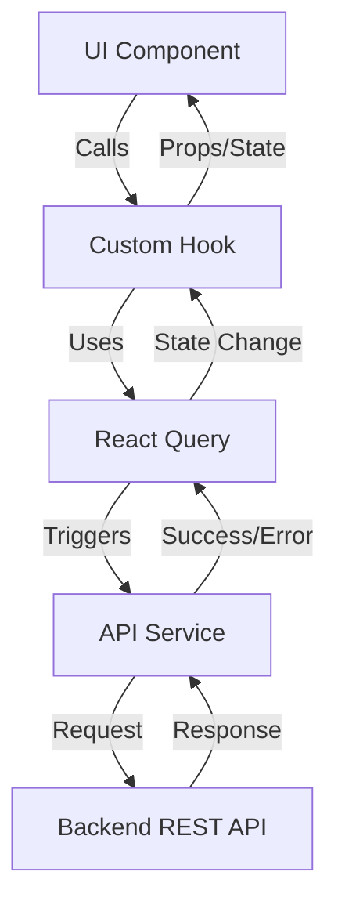

# Frontend Architecture: Parcel Collection Tracking System

To ensure scalability, maintainability, and premium performance, the frontend will follow a **Modular Feature-Based Architecture**.

## 📂 Proposed Folder Structure

```text
src/
├── assets/                    # Static assets (images, fonts, global icons)
│   ├── images/
│   ├── fonts/
│   └── icons/
│
├── components/                # Shared UI components
│   ├── ui/                    # shadcn/ui base components
│   │   ├── button.tsx
│   │   ├── input.tsx
│   │   ├── dialog.tsx
│   │   ├── toast.tsx
│   │   └── data-table.tsx
│   └── common/                # Custom shared components
│       ├── Navbar.tsx
│       ├── Footer.tsx
│       └── Layout.tsx
│
├── features/                  # Domain-driven modules
│   ├── tracking/              # Public parcel tracking feature
│   │   ├── api/
│   │   │   └── trackingApi.ts
│   │   ├── components/
│   │   │   ├── TrackingForm.tsx
│   │   │   ├── ParcelCard.tsx
│   │   │   └── StatusBadge.tsx
│   │   ├── hooks/
│   │   │   └── useParcelTracking.ts
│   │   └── types/
│   │       └── tracking.types.ts
│   │
│   └── dashboard/             # Admin dashboard feature
│       ├── api/
│       │   └── dashboardApi.ts
│       ├── components/
│       │   ├── LoginForm.tsx
│       │   ├── Sidebar.tsx
│       │   ├── AnalyticsCards.tsx
│       │   └── ParcelTable.tsx
│       ├── hooks/
│       │   ├── useAuth.ts
│       │   └── useParcels.ts
│       └── types/
│           └── dashboard.types.ts
│
├── hooks/                     # Global custom hooks
│   ├── useTheme.ts
│   └── useMediaQuery.ts
│
├── lib/                       # Library configurations
│   ├── axios.ts               # Axios instance with interceptors
│   ├── queryClient.ts         # React Query configuration
│   └── utils.ts               # shadcn/ui utility functions
│
├── services/                  # General API services
│   └── api.ts                 # Base API utilities
│
├── store/                     # Global state management
│   └── themeStore.ts          # Zustand store for theme
│
├── types/                     # Global TypeScript types
│   ├── api.types.ts
│   └── common.types.ts
│
└── utils/                     # Helper functions
    ├── dateFormatter.ts
    ├── validators.ts
    └── constants.ts
```

## 🏛️ Architecture Layers (Visual)

```text
┌─────────────────────────────────────────────────────────────┐
│                      PRESENTATION LAYER                      │
│  ┌────────────────────────────────────────────────────────┐  │
│  │         React Components (UI + shadcn/ui)              │  │
│  │  • TrackingForm  • ParcelCard  • Dashboard  • Login   │  │
│  └────────────────────────────────────────────────────────┘  │
└─────────────────────────────────────────────────────────────┘
                            ↕
┌─────────────────────────────────────────────────────────────┐
│                    BUSINESS LOGIC LAYER                      │
│  ┌────────────────────────────────────────────────────────┐  │
│  │              Custom Hooks (Logic)                      │  │
│  │  • useParcelTracking  • useParcels  • useAuth         │  │
│  └────────────────────────────────────────────────────────┘  │
└─────────────────────────────────────────────────────────────┘
                            ↕
┌─────────────────────────────────────────────────────────────┐
│                   STATE MANAGEMENT LAYER                     │
│  ┌────────────────────────────────────────────────────────┐  │
│  │         TanStack Query (Server State)                  │  │
│  │  • Caching  • Refetching  • Optimistic Updates        │  │
│  └────────────────────────────────────────────────────────┘  │
│  ┌────────────────────────────────────────────────────────┐  │
│  │         Zustand (Client State - Optional)              │  │
│  │  • Theme  • UI State                                   │  │
│  └────────────────────────────────────────────────────────┘  │
└─────────────────────────────────────────────────────────────┘
                            ↕
┌─────────────────────────────────────────────────────────────┐
│                       API LAYER                              │
│  ┌────────────────────────────────────────────────────────┐  │
│  │         Axios Instance + Services                      │  │
│  │  • Base URL  • Interceptors  • Error Handling         │  │
│  └────────────────────────────────────────────────────────┘  │
└─────────────────────────────────────────────────────────────┘
                            ↕
┌─────────────────────────────────────────────────────────────┐
│                    BACKEND REST API                          │
│         GET /parcels  •  POST /parcels  •  PATCH /parcels    │
└─────────────────────────────────────────────────────────────┘
```

## 🏗️ Core Architectural Principles

### 1. Separation of Concerns
- **UI vs Logic**: Components should focus on presentation. Complex logic (fetching, validation) should be abstracted into custom hooks or services.
- **Feature Encapsulation**: Everything related to a specific feature (like "Tracking") should live within its respective directory in `features/`.

### 2. State Management Strategy
- **Server State**: Managed entirely by **TanStack Query**. This handles caching, loading states, and synchronization with the backend automatically.
- **Global UI State**: If needed for lightweight state (like "Sidebar Open" or "Theme"), use **Zustand** or **React Context**.

### 3. API Layer (Service Pattern)
- Use a central **Axios instance** in `lib/axios.ts` to handle base URLs, headers, and interceptors (e.g., for JWT auth).
- Feature-specific services in `features/[name]/api/` will use this instance.

### 4. Component Pattern
- **Compound Components**: For complex UI like Modals or Tabs.
- **Custom Hooks Pattern**: Logic for components (fetching data, form handling) extracted into hooks for reusability and testing.

## 🔄 Data Flow Overview



## 💎 Design Consistency
- **Design Tokens**: All spacing, colors, and shadows are driven by **Tailwind CSS config**.
- **Theming**: Integrated Light/Dark mode support using `next-theme` logic (or standard CSS variables).

---
> [!TIP]
> This architecture is designed to grow. As the project scales, new features can be added by simply creating a new folder in `src/features` without affecting existing code.
