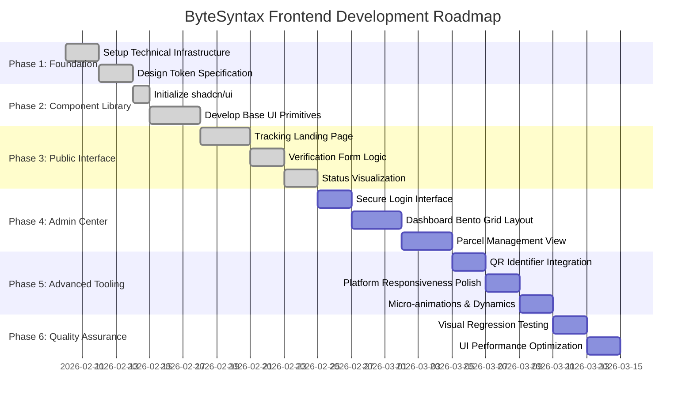

# Frontend Development Gantt Chart Activities

This document outlines the strategic timeline and activities for the **ByteSyntax** frontend development, focusing exclusively on visual implementation, user interaction, and client-side logic.

## 📅 Mermaid Gantt Chart

## 📝 Activity Breakdown

### Phase 1: Foundational Architecture
*   **Setup Technical Infrastructure**: Initialize Vite, React, Tailwind CSS v4, and directory structure.
*   **Design Token Specification**: Formalize CSS variables for colors (Logistic Flow) and typography (Playfair/Lato).

### Phase 2: Standardized Component Library
*   **Initialize shadcn/ui**: Set up the core component architecture.
*   **Develop Base UI Primitives**: Create buttons, inputs, cards, and modal systems following "Industrial Futurism" principles.

### Phase 3: Public Inquiry Interface
*   **Tracking Landing Page**: Build the high-visibility entry point for users.
*   **Verification Form**: Implement multi-parameter verification with optimistic validation.
*   **Status Visualization**: Create the kinetic status indicator (Pulse animations).

### Phase 4: Administrative Control Center
*   **Administrative Dashboard**: Implement the Bento Grid layout for real-time analytics.
*   **Parcel Interface**: Develop table-based and card-based views for managing parcel records.

### Phase 5: Advanced UI & Tooling
*   **QR System**: Client-side QR generation and scanning interface logic.
*   **Kinetic Dynamics**: Apply Framer Motion transitions and glassmorphism refinements.

### Phase 6: QA & Final Polish
*   **Cross-platform Checking**: Ensure consistent rendering across mobile and desktop.
*   **Performance Tuning**: Optimize asset loading and component re-renders.
